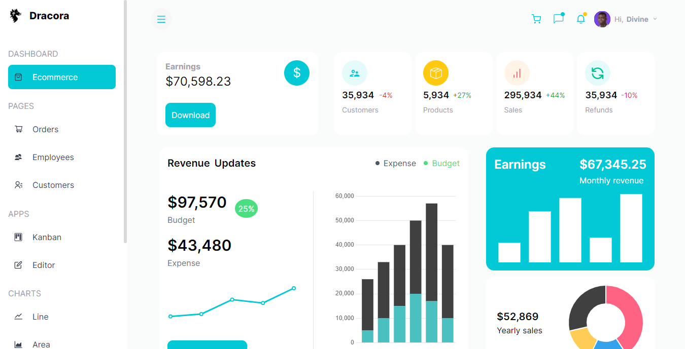

# Dracora

Dracora is data Visualization app with drag and drop functionality, an editor app, line, bar and other fun charts.

## Table of contents

- [Table of contents](#table-of-contents)
- [Overview](#overview)
  - [Screenshot](#screenshot)
  - [Links](#links)
  - [Built with](#built-with)
- [Installation](#installation)
- [Acknowledgement](#acknowledgement)
- [Author](#author)

## Overview

### Screenshot

### Links

- Live Site URL: [Click here](https://dracora.vercel.app/)

### Built with

- Typescript
- Next.js
- Chart.js
- Tailwind.css
- React-quill
- React-beautiful-dnd
- Mobile-first workflow

## Installation

- Clone repo into your drive
- cd into the repo
- run npm install on the terminal
- after installation of packages, run npm start

## Acknowledgement

- Kudos to Javascript mastery tutor for the designs

## Author

- Twitter - [@Dhevine_0X](https://www.twitter.com/Dhevine_0X)
